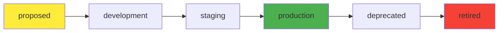

# APIs

APIs represent the interfaces that components expose and consume. Backstage supports various API specifications including OpenAPI, gRPC, and AsyncAPI.

## Example APIs

### OpenAPI Specification

```yaml
apiVersion: backstage.io/v1alpha1
kind: API
metadata:
  name: apis-guru
  description: The apis.guru REST API
spec:
  type: openapi
  lifecycle: production
  owner: group:admins
  definition:
    $openapi: https://api.apis.guru/v2/openapi.yaml
```

### gRPC Specification

```yaml
apiVersion: backstage.io/v1alpha1
kind: API
metadata:
  name: my-grpc-api-1
  description: Some grpc api
spec:
  type: grpc-docs
  lifecycle: production
  owner: group:admins
  definition: |
    {
      "syntax": "proto3",
      "package": "example",
      "messages": [
        {
          "name": "HelloRequest",
          "fields": [
            { "name": "name", "number": 1, "label": "optional", "type": "string" }
          ]
        }
      ],
      "services": [
        {
          "name": "Greeter",
          "methods": [
            {
              "name": "SayHello",
              "inputType": "HelloRequest",
              "outputType": "HelloReply"
            }
          ]
        }
      ]
    }
```

## API Types

| Type | Specification | Description |
|------|---------------|-------------|
| `openapi` | OpenAPI/Swagger | REST APIs |
| `grpc-docs` | Protocol Buffers | gRPC services |
| `asyncapi` | AsyncAPI | Event-driven APIs |
| `graphql` | GraphQL Schema | GraphQL APIs |
| `apigateway` | AWS API Gateway | AWS Gateway APIs |

## API Definition Sources

### External References

Load API specs from external URLs:

```yaml
spec:
  definition:
    $openapi: https://api.example.com/openapi.json
    $asyncapi: https://events.example.com/asyncapi.yaml
```

### Inline Definitions
Define API specs directly in the catalog:

```yaml
spec:
  definition: |
    openapi: 3.0.0
    info:
      title: My API
      version: 1.0.0
    paths:
      /users:
        get:
          summary: List users
```

### File References
Reference local files:

```yaml
spec:
  definition:
    $file: ./specs/api.yaml
```

## API Relationships

### Provided by Components
Components can expose APIs:

```yaml
apiVersion: backstage.io/v1alpha1
kind: Component
metadata:
  name: user-service
spec:
  providesApis: [user-api]
---
apiVersion: backstage.io/v1alpha1
kind: API
metadata:
  name: user-api
spec:
  # API definition
```

### Consumed by Components
Components can consume APIs:

```yaml
apiVersion: backstage.io/v1alpha1
kind: Component
metadata:
  name: frontend-app
spec:
  consumesApis: [user-api, payment-api]
```

## API Lifecycle



## API Documentation Features

### Interactive API Console
- **Try it out**: Test API endpoints directly
- **Parameter validation**: Ensure correct request format
- **Response examples**: See expected responses

### API Metrics
- **Usage statistics**: Track API adoption
- **Performance metrics**: Monitor response times
- **Error rates**: Track API health

## Best Practices

!!! tip "Versioning"
    Include version in API names:
    - ✅ `user-api-v1`
    - ✅ `payment-service-v2`
    - ❌ `user-api` (ambiguous)

!!! tip "Documentation"
    Always provide descriptions:
    ```yaml
    metadata:
      description: |
        User management API providing authentication,
        authorization, and profile management endpoints.
    ```

!!! tip "External Specs"
    Use external references for large specs:
    ```yaml
    spec:
      definition:
        $openapi: https://api.company.com/specs/openapi.yaml
    ```

## API Security

### Authentication Methods
Document authentication requirements:

```yaml
metadata:
  annotations:
    auth.backstage.io/required-methods: |
      - OAuth2
      - API Key
    auth.backstage.io/authorization-url: https://auth.company.com/oauth
```

### Security Scanning
Integrate with security tools:

```yaml
metadata:
  annotations:
    security.backstage.io/scan-results: |
      {"status": "passed", "score": 95}
```

---

!!! info "Info"
    API entities enable automatic API documentation generation and interactive testing through the Backstage UI.
