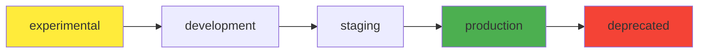

# Components

Components are the fundamental building blocks in the Backstage catalog. They represent individual pieces of software, services, websites, or any other deployable unit.

## Example Components

### Example Website

```yaml
apiVersion: backstage.io/v1alpha1
kind: Component
metadata:
  name: example-website
spec:
  type: website
  lifecycle: experimental
  owner: admins
  system: examples
  providesApis: [example-grpc-api]
```

### Example Node.js App

```yaml
apiVersion: backstage.io/v1alpha1
kind: Component
metadata:
  name: example-node-app
spec:
  type: service
  lifecycle: experimental
  owner: admins
  system: examples
  providesApis: [apis-guru]
```

## Component Types

Backstage supports various component types:

| Type | Description | Example Use |
|------|-------------|-------------|
| `service` | Backend services | APIs, microservices |
| `website` | Frontend applications | React apps, static sites |
| `library` | Shared code libraries | npm packages, modules |
| `application` | Complete applications | Full-stack apps |
| `operator` | Kubernetes operators | Cluster automation |

## Component Fields

### Required Fields

- **apiVersion**: Always `backstage.io/v1alpha1`
- **kind**: Always `Component`
- **metadata.name**: Unique identifier
- **spec.type**: Component type
- **spec.lifecycle**: Development stage
- **spec.owner**: Responsible team/group

### Optional Fields

- **spec.system**: Parent system
- **spec.providesApis**: APIs this component exposes
- **spec.consumesApis**: APIs this component uses
- **spec.dependsOn**: Other components/services
- **tags**: Categorization tags
- **description**: Human-readable description

## Lifecycle Stages



## Component Relationships

### API Relationships

Components can provide and consume APIs:

```yaml
spec:
  providesApis: [example-grpc-api]
  consumesApis: [external-payment-api]
```

### System Membership

Components belong to systems:

```yaml
spec:
  system: examples
```

### Dependencies
Components can depend on other resources:

```yaml
spec:
  dependsOn:
    - component:database-service
    - resource:postgres-cluster
```

## Best Practices

!!! tip "Naming"
    Use kebab-case for component names and be descriptive:
    - ✅ `user-authentication-service`
    - ❌ `svc1`

!!! tip "Ownership"
    Always specify an owner for accountability:
    ```yaml
    spec:
      owner: group:default/team-name
    ```

!!! tip "Documentation"
    Add descriptions and tags for discoverability:
    ```yaml
    metadata:
      description: Handles user authentication and authorization
      tags:
        - authentication
        - security
        - api
    ```

## Component Templates

Use the scaffolder to create new components:

1. Navigate to **Create** → **Example Node.js Template**
2. Fill in the required parameters
3. Choose a repository location
4. Execute the template

The generated component will automatically include:

- `catalog-info.yaml` with proper metadata
- Basic project structure
- CI/CD configuration (if included)

---

!!! info "Info"
    Components are automatically discovered by the catalog when their `catalog-info.yaml` files are added to registered locations.
