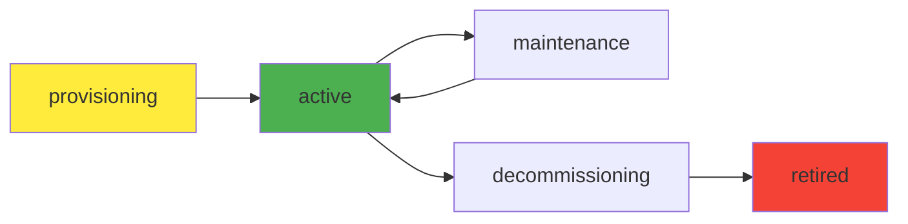

# Resources

Resources represent infrastructure and operational assets that support your components and systems. These can include databases, message queues, storage systems, and other cloud resources.

## Example Resources

```yaml
apiVersion: backstage.io/v1alpha1
kind: Resource
metadata:
  name: example-database
  description: Example PostgreSQL database
spec:
  type: database
  owner: admins
  system: examples
```

## Resource Types

| Type | Description | Examples |
|------|-------------|----------|
| `database` | Data storage | PostgreSQL, MySQL, MongoDB |
| `messagequeue` | Messaging systems | RabbitMQ, Kafka, SQS |
| `storage` | File/object storage | S3, GCS, Azure Blob |
| `cache` | Caching systems | Redis, Memcached |
| `monitoring` | Observability tools | Prometheus, Grafana |
| `network` | Network resources | Load balancers, CDNs |
| `compute` | Compute resources | VMs, containers, serverless |

## Resource Fields

### Required Fields
- **apiVersion**: Always `backstage.io/v1alpha1`
- **kind**: Always `Resource`
- **metadata.name**: Unique identifier
- **spec.type**: Resource type
- **spec.owner**: Responsible team/group

### Optional Fields
- **spec.system**: Parent system
- **description**: Human-readable description
- **tags**: Categorization tags
- **spec.dependsOn**: Resource dependencies

## Resource Relationships

### System Association
Resources belong to systems:

```yaml
apiVersion: backstage.io/v1alpha1
kind: Resource
metadata:
  name: user-database
spec:
  type: database
  owner: team:platform
  system: user-management
```

### Component Dependencies
Components depend on resources:

```yaml
apiVersion: backstage.io/v1alpha1
kind: Component
metadata:
  name: user-service
spec:
  dependsOn:
    - resource:user-database
    - resource:user-cache
```

### Resource Chaining
Resources can depend on other resources:

```yaml
apiVersion: backstage.io/v1alpha1
kind: Resource
metadata:
  name: database-backup-storage
spec:
  type: storage
  owner: team:platform
  dependsOn:
    - resource:main-database
```

## Resource Lifecycle Management



## Resource Annotations

### Cloud Provider Information
```yaml
metadata:
  annotations:
    cloud.amazon.com/region: us-west-2
    cloud.amazon.com/instance-type: db.t3.medium
    cloud.amazon.com/arn: arn:aws:rds:...
```

### Monitoring and Metrics
```yaml
metadata:
  annotations:
    prometheus.io/scrape: "true"
    prometheus.io/port: "9090"
    grafana.com/dashboard-url: https://grafana.company.com/d/db-stats
```

### Cost Management
```yaml
metadata:
  annotations:
    cost-center: engineering
    billing-code: ENG-DB-001
    monthly-cost: "$250"
```

## Best Practices

!!! tip "Resource Naming"
    Use descriptive names that indicate type and purpose:
    - ✅ `user-postgresql-prod`
    - ✅ `order-redis-cache`
    - ❌ `db1`

!!! tip "Ownership"
    Assign clear ownership for accountability:
    ```yaml
    spec:
      owner: group:default/platform-team
    ```

!!! tip "Documentation"
    Provide detailed descriptions:
    ```yaml
    metadata:
      description: |
        PostgreSQL database for user management system.
        Configured with automated backups and read replicas.
        Version 14.5, 100GB storage, multi-AZ deployment.
    ```

## Resource Examples

### Database Resource
```yaml
apiVersion: backstage.io/v1alpha1
kind: Resource
metadata:
  name: user-postgresql
  description: Primary database for user management
  annotations:
    cloud.amazon.com/rds-engine: postgres
    cloud.amazon.com/rds-version: "14.5"
    backup.backstage.io/schedule: "0 2 * * *"
spec:
  type: database
  owner: team:platform
  system: user-management
```

### Message Queue Resource
```yaml
apiVersion: backstage.io/v1alpha1
kind: Resource
metadata:
  name: order-events
  description: Kafka cluster for order processing events
  annotations:
    kafka.backstage.io/cluster-name: order-events-prod
    kafka.backstage.io/topics: orders,payments,inventory
spec:
  type: messagequeue
  owner: team:infrastructure
  system: order-processing
```

### Monitoring Resource
```yaml
apiVersion: backstage.io/v1alpha1
kind: Resource
metadata:
  name: prometheus-cluster
  description: Monitoring and metrics collection
  annotations:
    prometheus.io/url: https://prometheus.company.com
    grafana.com/workspace-url: https://grafana.company.com
spec:
  type: monitoring
  owner: team:observability
```

## Resource Discovery

Resources are automatically discovered through:
- **Cloud provider APIs** (AWS, GCP, Azure)
- **Kubernetes clusters** (custom resources)
- **Configuration management** (Terraform, CloudFormation)
- **Manual registration** (YAML files)

---

!!! info "Info"
    Resources provide visibility into your infrastructure landscape and help teams understand dependencies and ownership.
