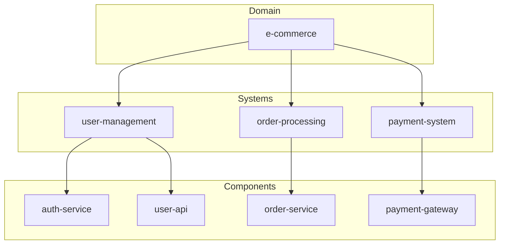

# Systems

Systems provide a way to group related components and represent large-scale software systems or business capabilities.

## Example System

```yaml
apiVersion: backstage.io/v1alpha1
kind: System
metadata:
  name: examples
spec:
  owner: admins
```

## System Purpose

Systems help organize your software landscape by:

- **Grouping related components** that work together
- **Defining ownership** at the system level
- **Providing context** for understanding component relationships
- **Enabling system-level metrics** and monitoring

## System Fields

### Required Fields

- **apiVersion**: Always `backstage.io/v1alpha1`
- **kind**: Always `System`
- **metadata.name**: Unique identifier
- **spec.owner**: Responsible team/group

### Optional Fields

- **description**: Human-readable description
- **tags**: Categorization tags
- **domain**: Business domain this system belongs to

## System Hierarchy



## System Relationships

### Domain Association

Systems can belong to business domains:

```yaml
apiVersion: backstage.io/v1alpha1
kind: System
metadata:
  name: user-management
  description: Handles user authentication and profiles
spec:
  owner: team:identity
  domain: customer-platform
```

### Component Membership

Components reference their parent system:

```yaml
apiVersion: backstage.io/v1alpha1
kind: Component
metadata:
  name: auth-service
spec:
  type: service
  owner: team:identity
  system: user-management  # References the system
```

## System Types

While Backstage doesn't enforce specific system types, common patterns include:

| Type | Description | Example |
|------|-------------|---------|
| Business System | End-to-end business capability | Order Processing |
| Platform System | Shared infrastructure | Authentication Platform |
| Data System | Data management and analytics | Customer Analytics |
| Integration System | External service integrations | Payment Gateway |

## Best Practices

!!! tip "Scope"
    Keep systems focused on a single business capability:
    - ✅ "User Authentication"
    - ❌ "All User and Order Related Stuff"

!!! tip "Ownership"
    Assign clear ownership at the system level:
    ```yaml
    spec:
      owner: group:default/platform-team
    ```

!!! tip "Documentation"
    Provide clear descriptions for understanding:
    ```yaml
    metadata:
      description: |
        Handles user registration, authentication, and profile management.
        Integrates with external identity providers and provides SSO capabilities.
    ```

## System Metrics and Monitoring

Systems enable higher-level insights:

- **System health dashboard**: Overview of all component health
- **Dependency mapping**: Visualize system relationships
- **Ownership tracking**: Clear responsibility assignment
- **Compliance reporting**: System-level security and compliance

## Example: Complete System Definition

```yaml
apiVersion: backstage.io/v1alpha1
kind: System
metadata:
  name: customer-portal
  title: Customer Portal System
  description: |
    Complete customer-facing portal including authentication, 
    profile management, and order tracking capabilities.
  tags:
    - customer-facing
    - web-app
    - business-critical
  annotations:
    backstage.io/techdocs-ref: dir:./docs
spec:
  owner: group:default/customer-experience
  domain: retail-platform
```

---

!!! info "Info"
    Systems are optional but highly recommended for medium to large organizations. They provide crucial context for understanding your software ecosystem.
