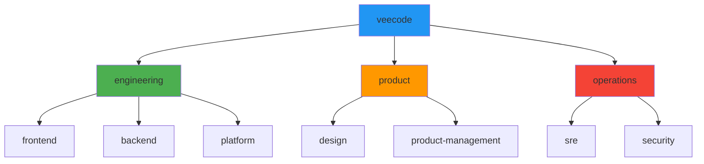

# Users and Groups

Users and Groups define the organizational structure and ownership model in Backstage. They enable proper access control, responsibility assignment, and collaboration features.

## Example Organization

### Users
```yaml
apiVersion: backstage.io/v1alpha1
kind: User
metadata:
  name: admin
spec:
  profile:
    displayName: Administrator
    email: admin@veecode.com
    picture: https://avatars.githubusercontent.com/u/1?v=4
  memberOf: [admins]
```

### Groups
```yaml
apiVersion: backstage.io/v1alpha1
kind: Group
metadata:
  name: admins
  description: The VeeCode DevPortal administrators
spec:
  type: team
  profile:
    displayName: Administrators
    email: admins@veecode.com
  parent: veecode
  children: []
```

## User Fields

### Required Fields
- **apiVersion**: Always `backstage.io/v1alpha1`
- **kind**: Always `User`
- **metadata.name**: Unique username identifier

### Optional Fields
- **spec.profile**: User profile information
- **spec.memberOf**: Groups the user belongs to

### Profile Fields
- **displayName**: Human-readable name
- **email**: Email address
- **picture**: Profile picture URL

## Group Fields

### Required Fields
- **apiVersion**: Always `backstage.io/v1alpha1`
- **kind**: Always `Group`
- **metadata.name**: Unique group identifier
- **spec.type**: Group type (team, department, etc.)

### Optional Fields
- **spec.profile**: Group profile information
- **spec.parent**: Parent group (for hierarchy)
- **spec.children**: Child groups (for hierarchy)

## Group Hierarchy



### Hierarchical Group Example
```yaml
# Root organization
apiVersion: backstage.io/v1alpha1
kind: Group
metadata:
  name: veecode
spec:
  type: organization
  profile:
    displayName: VeeCode
    email: info@veecode.com
  children: [engineering, product, operations]

---
# Department
apiVersion: backstage.io/v1alpha1
kind: Group
metadata:
  name: engineering
spec:
  type: department
  profile:
    displayName: Engineering Department
  parent: veecode
  children: [frontend, backend, platform]

---
# Team
apiVersion: backstage.io/v1alpha1
kind: Group
metadata:
  name: frontend
spec:
  type: team
  profile:
    displayName: Frontend Team
    email: frontend@veecode.com
  parent: engineering
```

## Group Types

| Type | Description | Example |
|------|-------------|---------|
| `organization` | Root organization | VeeCode |
| `department` | Business unit | Engineering |
| `team` | Development team | Frontend |
| `squad` | Small working group | Mobile Squad |
| `guild` | Community of practice | Security Guild |

## Ownership Patterns

### Group Ownership
Entities are owned by groups:

```yaml
apiVersion: backstage.io/v1alpha1
kind: Component
metadata:
  name: user-service
spec:
  owner: group:default/backend-team
```

### User Ownership (Limited)
Users can own entities, but groups are preferred:

```yaml
apiVersion: backstage.io/v1alpha1
kind: Component
metadata:
  name: personal-project
spec:
  owner: user:default/john.doe
```

## Authentication Integration

### Guest User Configuration
```yaml
# app-config.yaml
auth:
  providers:
    guest:
      userEntityRef: user:default/admin
      ownershipEntityRefs: [group:default/admins]
```

### Provider Integration
Users and groups can be synchronized with:
- **GitHub Organizations** and Teams
- **Google Workspace** Groups
- **Azure AD** Users and Groups
- **LDAP/Active Directory** entries
- **Custom SSO providers**

## Best Practices

!!! tip "Group Ownership"
    Prefer group ownership over user ownership:
    - ✅ `owner: group:default/team-name`
    - ❌ `owner: user:default/person.name`

!!! tip "Hierarchical Structure"
    Use meaningful group hierarchies:
    ```yaml
    organization -> department -> team -> squad
    ```

!!! tip "Complete Profiles"
    Provide complete user and group profiles:
    ```yaml
    spec:
      profile:
        displayName: Full Name
        email: team@company.com
        picture: https://example.com/avatar.png
    ```

!!! tip "Consistent Naming"
    Use consistent naming conventions:
    - Users: `firstname.lastname`
    - Groups: `team-name`, `department-name`

## Permission Integration

Users and groups integrate with the permission framework:

```yaml
# rbac-policy.csv
p, role:default/catalog-writer, catalog.entity, create, allow
g, group:default/engineering, role:default/catalog-writer
g, user:default/john.doe, group:default/engineering
```

---

!!! info "Info"
    Users and groups form the foundation of Backstage's access control and collaboration features. Keep them synchronized with your identity provider for best results.
