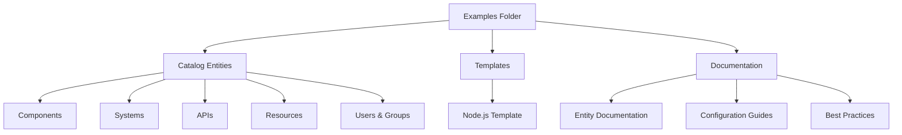

# Examples Catalog Documentation

Welcome to the comprehensive documentation for the VeeCode DevPortal examples folder. This documentation serves as a complete catalog reference and guide for understanding the default installation examples.

## Overview

The `examples/` folder contains sample catalog entities, templates, and configurations that demonstrate the full capabilities of the VeeCode DevPortal. These examples are automatically loaded when you start the DevPortal and provide a working demonstration of:

- **Catalog entities** (Components, Systems, APIs, Resources, Users, Groups)
- **Software templates** for scaffolding new projects
- **Configuration examples** for different integrations

## Quick Start

1. **Browse the Catalog**: Navigate to the Catalog page to see all example entities
2. **Explore Templates**: Check out the Create page to see available software templates
3. **Read Documentation**: Use the navigation to explore detailed documentation for each entity type

## What You'll Find Here

## Getting Help

- **For developers**: Check the [Configuration](configuration/) section for setup details
- **For users**: Browse the [Entity Types](entities/) section to understand catalog concepts
- **For administrators**: See [Best Practices](configuration/best-practices.md) for deployment guidance

---

!!! tip "Tip"
    These examples are designed to be modified and extended. Use them as starting points for your own catalog entities and templates.
