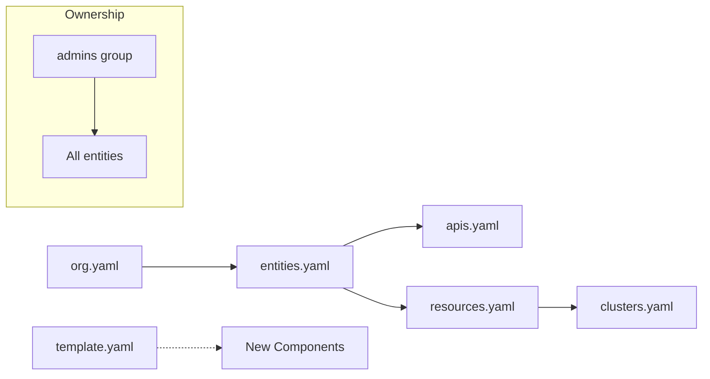
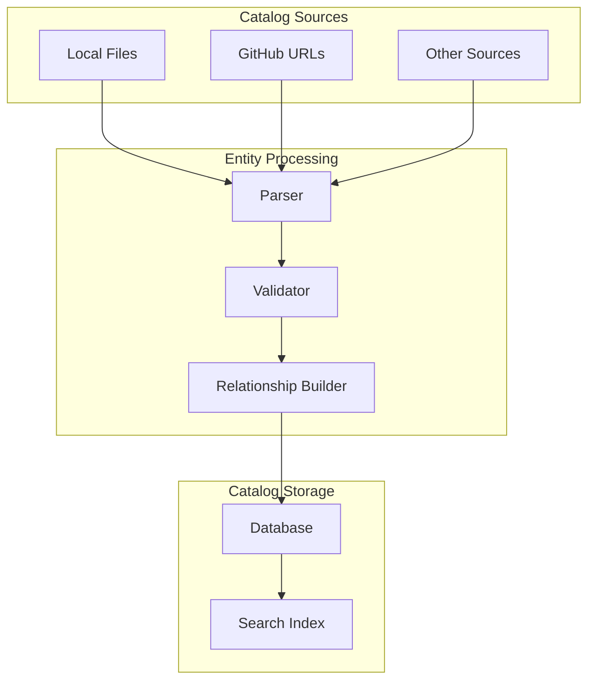

# Catalog Files Overview

Each file in the examples folder serves a specific purpose in the Backstage catalog. This section explains what each file contains and how it contributes to the overall catalog structure.

## Entity Relationships



## File Details

### entities.yaml
**Purpose**: Defines the main software catalog entities
**Contains**:
- 1 System (`examples`)
- 2 Components (`example-website`, `example-node-app`)
- 1 API (`example-grpc-api`)

**Key Features**:
- Demonstrates component-to-API relationships
- Shows system ownership patterns
- Uses `admins` group as owner

### org.yaml
**Purpose**: Defines organizational structure
**Contains**:
- 1 User (`admin`)
- 1 Group (`admins`)

**Key Features**:
- Establishes ownership hierarchy
- Provides default user for guest access
- Groups users for permission management

### apis.yaml
**Purpose**: Defines API specifications
**Contains**:
- 1 OpenAPI spec (`apis-guru`)
- 1 gRPC spec (`my-grpc-api-1`)

**Key Features**:
- Shows external API integration (apis.guru)
- Demonstrates inline gRPC definitions
- Uses different API types

### resources.yaml
**Purpose**: Defines infrastructure resources
**Contains**:
- Example resource definitions

**Key Features**:
- Shows resource-to-component relationships
- Demonstrates resource types and metadata

### clusters.yaml
**Purpose**: Defines Kubernetes clusters
**Contains**:
- Example cluster configurations

**Key Features**:
- Shows cluster integration patterns
- Demonstrates cluster metadata

## Common Patterns

### Ownership Pattern
All entities use the `admins` group:
```yaml
spec:
  owner: group:default/admins
```

### System Grouping
Components belong to the `examples` system:
```yaml
spec:
  system: examples
```

### Lifecycle Management
Entities use standard lifecycle stages:
```yaml
spec:
  lifecycle: experimental  # or production
```

## Integration Points



---

!!! info "Info"
    The catalog automatically processes relationships between entities. When you reference a system, API, or owner, Backstage creates the necessary links in the UI.
